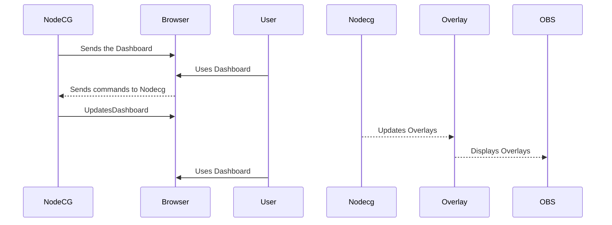

# SSE
Everything Silver State Esports

## Installing
	
First make sure you have nodejs (found [here](https://nodejs.org/))installed. 
Then in the command line for your os, execute the following commands.

    git clone https://github.com/0x000NULL/SSE.git
    cd SSE
    npm install -g nodecg-cli
    nodecg setup
    npm install
    cd .\bundles\ssbutw 
    npm install
    cd ../../
    nodecg start
After doing so, in your browser navigate to http://localhost:9090

## Developing

 1. Clone the repo 
 2. make your changes 
 3. run `npm run-script build` 
 4. install the node dependencies for the bundle

Hows NodeCG works with OBS

